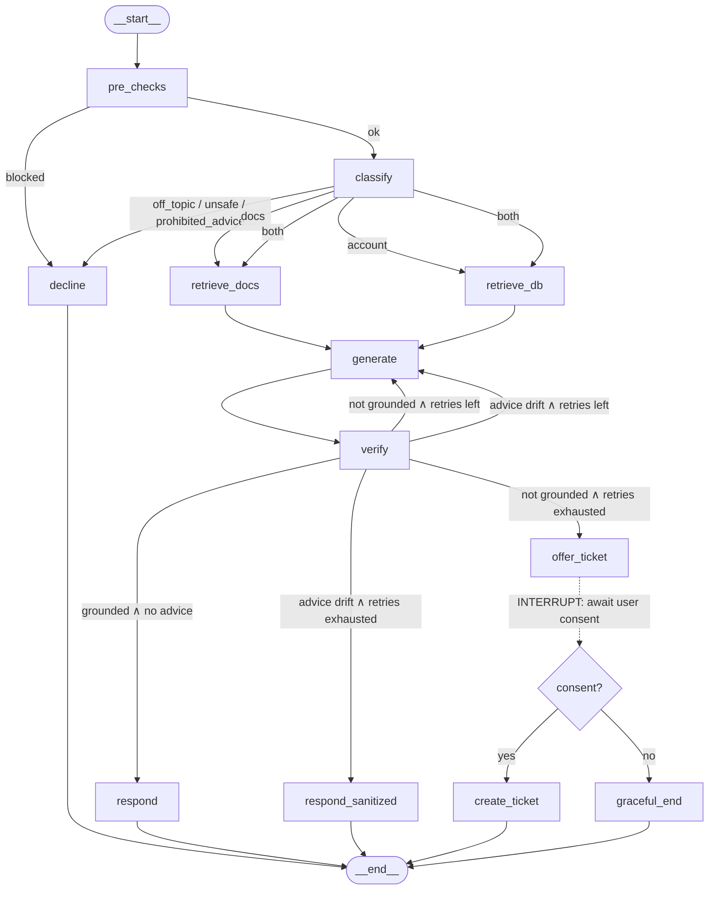

# RAG-Based Agentic Chatbot — Architecture Reference (v1)

**Project:** Investment Infrastructure Platform — Customer Support Chatbot
**Architecture:** v1 — LangGraph State Machine with Faithfulness Gate, Guardrails, and Human-in-the-Loop
**Stack:** Python · LangChain · LangGraph · OpenAI API · FastAPI · Streamlit · PostgreSQL (+ pgvector)
**Status:** Approved design, pre-implementation
**Audience:** Engineering team

---

## 1. Purpose and Scope

The chatbot serves end customers of financial institutions using our platform. It answers two classes of questions:

1. **Product documentation Q&A** — questions about Digital Fixed Deposits, Digital Gold, Bonds, and Mutual Funds, answered strictly from our maintained product documentation.
2. **Customer-specific account queries** — questions about the customer's own accounts, holdings, and transactions, answered from the PostgreSQL database (1 demographics table + 4 product tables).

Hard requirements the architecture must structurally guarantee:

- **Faithfulness:** every answer must be supported by the documentation and/or database. No parametric LLM knowledge, no external information.
- **Guardrails:** off-topic, unsafe, and investment-advice requests are declined gracefully. Advice restrictions are a compliance concern in fintech, not a nice-to-have.
- **Human-in-the-loop (HITL):** when the system cannot answer reliably from its sources, it informs the customer and offers to raise a support ticket.
- **Configurability:** new products are added via configuration, not code changes. The framework is reusable for other clients by swapping config, docs, and DB connection.
- **Data safety:** a customer can only ever see their own data; the LLM never writes SQL and never supplies the customer identity.

---

## 2. Architecture Diagram

### 2.1 Graph topology (as LangGraph `.compile()` renders it)



### 2.2 ASCII equivalent (for terminals / plain-text contexts)

```
FastAPI (auth → session ctx: customer_id, thread_id)
   │
   ▼
[0] pre_checks ── blocked ──────────────────────────────┐
   │ ok                                                 │
   ▼                                                    ▼
[1] classify ── off_topic/unsafe/prohibited_advice ─▶ [D] decline ─▶ END
   │
   ├─ docs ────▶ [2a] retrieve_docs ──┐
   ├─ account ─▶ [2b] retrieve_db ────┤   (parallel when "both")
   └─ both ────▶ 2a ∥ 2b ─────────────┤
                                      ▼
                              [3] generate ◀────────────┐
                                      │                 │ retry with
                                      ▼                 │ typed feedback
                              [4] verify ───────────────┘
                                      │
        ┌─────────────────────────────┼──────────────────────────────┐
        │ pass                        │ not grounded,                │ advice drift,
        ▼                             │ retries exhausted            │ retries exhausted
  [5] respond ─▶ END                  ▼                              ▼
                              [6] offer_ticket              [5b] respond_sanitized ─▶ END
                                      │
                          ═══ INTERRUPT (checkpoint, wait) ═══
                                      │ user consents?
                              ┌───────┴────────┐
                             yes               no
                              ▼                ▼
                      [7] create_ticket   graceful_end
                              └───────┬────────┘
                                     END
```

### 2.3 System context (around the graph)

```
Streamlit UI ──HTTP──▶ FastAPI ──invoke/resume──▶ LangGraph StateGraph
                          │                            │
                          │ auth, session,             ├─▶ pgvector (doc chunks)
                          │ thread_id mgmt             ├─▶ PostgreSQL (customer tables, read-only role)
                          │                            ├─▶ OpenAI API (classify / generate / verify)
                          │                            ├─▶ Ticket service (support system API)
                          │                            └─▶ PostgresSaver (graph checkpoints)
                          └────────── products.yaml + sql_templates.yaml (loaded at startup)
```

---

## 3. Node-by-Node Explanation

Each subsection: **what it does**, and **why it exists** (the reasoning behind the design decision).

### 3.0 `pre_checks` — deterministic input gate

**What it does:** Non-LLM validations before anything else runs: maximum input length, empty-input rejection, and (optionally) the OpenAI moderation endpoint for abusive content.

**Why it exists:** The cheapest place to stop garbage is before the first LLM call. Deterministic checks cost microseconds, cannot be prompt-injected, and protect the token budget. The moderation endpoint is free and fast, so it is worth calling here rather than spending a classify call on abuse.

### 3.1 `classify` — intent router + input-side guardrail

**What it does:** A single LLM call (cheap/fast model, structured output) that reads the user query and emits:

```python
class ClassifyResult(BaseModel):
    query_type: Literal["docs", "account", "both",
                        "off_topic", "unsafe", "prohibited_advice"]
    products: list[str]   # validated against registry.product_ids()
```

Conditional edges route on this result. The valid product labels are built **dynamically from the product registry** — the prompt is regenerated from config at startup.

**Why it exists — routing:** Docs questions and account questions need entirely different retrieval machinery. One classification decision up front keeps every downstream node simple and single-purpose.

**Why it exists — guardrail folded in (Option B):** Deciding "is this in scope at all" is the same comprehension task as deciding "docs or account." Folding the guardrail into classify avoids an extra LLM call on every query (a separate guardrail node would tax the ~95% of legitimate traffic to catch the rare bad query). The three decline categories exist because they need **different exits**:

| Category | Example | Exit |
|---|---|---|
| `off_topic` | "What's the weather?" | Templated decline. No ticket — a human agent can't answer it either. |
| `unsafe` | "Help me hack an account" | Firm templated decline, logged. No ticket. |
| `prohibited_advice` | "Should I invest in FD or gold?" | Decline the advice; offer facts instead. Compliance requirement. |

**Validation rule:** if the LLM emits a product name not in the registry, treat it as a failure — retry once, else route to decline. Invented labels never flow downstream.

### 3.D `decline` — templated refusals

**What it does:** Returns a fixed, pre-approved string per category (with the product list interpolated for `off_topic`). No LLM call.

**Why it exists:** Decline wording in a regulated domain should be deterministic and compliance-approvable. A canned string costs nothing, cannot hallucinate, and cannot be prompt-injected into saying something else.

### 3.2a `retrieve_docs` — documentation retrieval

**What it does:** Vector search (top-k) against the routed product's collection(s) in pgvector. Collection names come from the registry (`registry.get(product).doc_collection`). Returns chunks with source metadata into state.

**Why it exists:** Standard RAG retrieval, scoped per product. Scoping matters: searching only the relevant product's collection improves precision and prevents cross-product contamination (e.g., FD penalty rules bleeding into a gold answer). pgvector was chosen because we already operate PostgreSQL — no new infrastructure for v1.

### 3.2b `retrieve_db` — parameterized SQL execution

**What it does:** Two steps.

1. An LLM structured-output call selects a **pre-written SQL template** by name and fills its typed parameters. It is shown only the templates for the routed product (filtered via the registry).
2. A deterministic executor validates the template name exists, type-checks parameters (Pydantic), **injects `customer_id` from the authenticated session**, and executes with bound parameters on a read-only DB role.

```yaml
# sql_templates.yaml (excerpt)
fd_transactions_by_date:
  description: "A customer's FD transactions within a date range"
  sql: |
    SELECT txn_id, fd_id, txn_type, amount, txn_date
    FROM fd_transactions
    WHERE customer_id = :customer_id
      AND txn_date BETWEEN :start_date AND :end_date
    ORDER BY txn_date DESC
  params:
    - {name: start_date, type: date}
    - {name: end_date, type: date}
```

Note: `:customer_id` appears in every template but is **not** in `params` — the LLM cannot supply or override it.

**Why templates and not text-to-SQL (the critical v1 decision):**

- **Correctness:** the LLM cannot hallucinate a join, misname a column, or write a wrong-but-plausible aggregate. In fintech, a plausible wrong number is worse than "I don't know." Worst case it picks the wrong template or none — both detectable failures that route to HITL.
- **Security:** fixed SQL text + bound parameters = no injection surface. A malicious "date" like `'; DROP TABLE--` is just a string that fails date validation.
- **Data isolation:** "Show transactions for customer 999" still executes with the *session's* customer_id. Identity never passes through the model.
- **Testability:** every template is unit-testable SQL.

The trade-off — coverage grows only as fast as the template library — is accepted for v1 and is the primary driver of the v2 migration path (§6).

### 3.3 `generate` — context-only answer drafting

**What it does:** The strong model drafts an answer from **only** the retrieved context (doc chunks + query results). The prompt enforces:

- Inline citations (`[D1]`, `[DB]`) mapping each claim to a chunk or result set.
- A sentinel — `INSUFFICIENT_CONTEXT` — when the context does not cover the question (routes directly to `offer_ticket`).
- No recommendations or suitability language.

On retry entries, the verifier's typed feedback is appended (see 3.4).

**Why it exists:** Separating drafting from verification lets each prompt do one job well. The citation requirement is not cosmetic — it is what makes claim-level verification tractable in the next node.

### 3.4 `verify` — the faithfulness gate + output-side guardrail

**What it does:** Three checks on the draft; the graph topology guarantees **no path from `generate` to the user bypasses this node**.

1. **Groundedness (LLM-as-judge, cheap model):** given (question, context, draft), verify every factual claim against the context. Claim-level, not answer-level — "mostly grounded" fails.
2. **Deterministic numeric/date matching (DB answers):** regex-extract numbers and dates from the draft and assert they literally appear in the query results. LLM judges miss transposed digits; string matching does not. This cheap check catches the most damaging error class in a financial context.
3. **Advice-drift detection (output-side guardrail):** flag recommendation/suitability language that leaked into an otherwise factual answer.

```python
class VerifyResult(BaseModel):
    grounded: bool
    unsupported_claims: list[str]
    contains_advice: bool
    advice_snippets: list[str]
```

**Routing logic — the two failure modes have different remedies:**

```python
def route_after_verify(state) -> str:
    v = state["verification"]
    if v.grounded and not v.contains_advice:
        return "respond"
    if not v.grounded:                                  # knowledge problem
        if state["retry_count"] < MAX_RETRIES:
            return "generate"                           # + unsupported-claims feedback
        return "offer_ticket"                           # genuine gap → HITL
    if state["retry_count"] < MAX_RETRIES:              # style problem (advice drift)
        return "generate"                               # + strip-advice feedback
    return "respond_sanitized"                          # NEVER ticket for drift
```

Typed retry feedback:

```python
def build_retry_feedback(v: VerifyResult) -> str:
    if not v.grounded:
        return (f"The following claims were not supported by the context, "
                f"remove or correct them: {v.unsupported_claims}")
    return (f"Remove all recommendation/suitability language. Do not suggest "
            f"what the user should choose or do. Restate facts only. "
            f"Offending snippets: {v.advice_snippets}")
```

**Why advice drift never routes to a ticket:** it is a *phrasing* failure, not a knowledge gap — the facts are already correct and a human agent adds nothing. Keeping it out of the HITL path keeps the ticket queue meaningful: **every ticket represents a genuine knowledge gap.**

**Why a shared `retry_count`:** one counter incremented on every re-entry to `generate`, regardless of failure type. This keeps the loop provably bounded and the state simple. Split into per-type budgets later only if logs show they need it.

### 3.5 `respond` / 3.5b `respond_sanitized`

**What they do:** `respond` formats the verified draft (citations rendered as sources) and returns it. `respond_sanitized` is the rare fallback when a draft is grounded but advice drift survives all retries: **deterministically** drop the sentences containing `advice_snippets`, respond with the remaining grounded facts, and append the standard "facts, not recommendations" line.

**Why `respond_sanitized` exists:** the answer's facts are verified — discarding them (or ticketing) would be a dead end for a solved problem. Deterministic sentence removal cannot introduce new hallucinations the way another LLM rewrite could.

### 3.6 `offer_ticket` — the HITL interrupt

**What it does:** Tells the customer a reliable answer could not be found and asks whether to raise a support ticket. Then the graph hits a **LangGraph interrupt**: full state is checkpointed via `PostgresSaver`, the graph pauses, and FastAPI returns the question to the UI. When the user replies, FastAPI resumes the graph on the same `thread_id`; consent routes to `create_ticket`, otherwise to a graceful end.

**Why interrupts (the reason LangGraph was chosen over plain chains):** "offer → wait for consent → act" is a multi-turn, stateful interaction. With chains, this state management must be hand-rolled in the API layer. LangGraph's interrupt + checkpointer makes it native — and because checkpoints live in Postgres, the paused state survives process restarts and works across load-balanced replicas.

**Reachability invariant:** `offer_ticket` is reachable *only* from groundedness exhaustion or `INSUFFICIENT_CONTEXT`.

### 3.7 `create_ticket`

**What it does:** Calls the support system's API with the full conversation state attached — the query, what was retrieved, the draft, and why verification failed.

**Why the rich payload:** the human agent starts with complete context instead of re-interviewing the customer. The failure report ("retrieved these chunks, these claims were unsupported") also doubles as telemetry for content gaps (§7).

---

## 4. State Schema

```python
class GraphState(TypedDict):
    query: str
    intent: str                    # docs|account|both|off_topic|unsafe|prohibited_advice
    products: list[str]
    doc_context: list[Chunk]       # chunk text + source metadata
    db_context: list[QueryResult]  # template_id + typed rows
    draft: str
    verification: VerifyResult
    retry_count: int
    decline_category: str | None
    ticket_id: str | None
```

Session context (`customer_id`, `thread_id`) lives in FastAPI's authenticated session and is passed into node execution — **`customer_id` is never part of LLM-visible state.**

---

## 5. Configuration Layer (the extensibility mechanism)

The architecture is generic; **all product-specific facts live in configuration**, loaded once at startup by `core/registry.py`:

```yaml
# products.yaml
digital_fd:
  display_name: "Digital Fixed Deposits"
  doc_collection: "fd_docs"
  db_tables: ["fd_accounts", "fd_transactions"]
  sql_templates: ["fd_holdings", "fd_transactions_by_date", "fd_maturity"]
digital_gold:
  display_name: "Digital Gold"
  doc_collection: "gold_docs"
  db_tables: ["gold_holdings"]
  sql_templates: ["gold_holdings", "gold_transactions_by_date"]
# bonds, mutual_funds ...
```

The registry feeds every node: classify builds its label set from `product_ids()`, retrieve_docs resolves `doc_collection`, retrieve_db filters templates and enforces `db_tables` as the table allowlist.

**Consequences:**

- **New product** = one YAML block + doc ingestion + SQL templates + read access to its tables. Zero core-logic changes.
- **New client** = same codebase; swap `products.yaml`, `sql_templates.yaml`, the doc corpus, and the DB connection string.

---

## 6. Module Plan

```
app/
  config/
    products.yaml            # product registry (per-client)
    sql_templates.yaml       # parameterized SQL library (per-client)
    decline_templates.py     # fixed, compliance-approved decline strings
    settings.py              # env, model names, MAX_RETRIES, top-k, etc.
  core/
    registry.py              # loads/validates products.yaml → ProductConfig objects
    models.py                # shared Pydantic models (ClassifyResult, VerifyResult, ...)
  retrieval/
    ingestion.py             # doc chunking + embedding → pgvector (offline job)
    retriever.py             # collection-scoped vector search
  db/
    templates.py             # loads/validates sql_templates.yaml
    executor.py              # type-check params, inject customer_id, bound-param
                             #   execution, read-only role, row limits
  verification/
    judge.py                 # LLM groundedness judge (structured output)
    numeric_check.py         # deterministic number/date matching vs DB results
    advice_check.py          # advice-drift detection (part of judge prompt + parse)
  graph/
    state.py                 # GraphState TypedDict
    nodes/
      pre_checks.py
      classify.py
      retrieve_docs.py
      retrieve_db.py
      generate.py
      verify.py
      respond.py             # respond + respond_sanitized
      decline.py
      tickets.py             # offer_ticket (interrupt) + create_ticket
    routing.py               # route_after_classify, route_after_verify
    builder.py               # graph assembly + PostgresSaver checkpointer + compile()
  services/
    tickets.py               # support-system API client
    llm.py                   # model clients: cheap (classify/verify) vs strong (generate)
  api/
    auth.py                  # session → customer_id (FastAPI dependency)
    routes.py                # POST /chat (invoke), POST /resume (interrupt resume)
    schemas.py               # request/response models
  observability/
    logging.py               # per-node structured logs, decline categories,
                             #   verify verdicts (→ future eval set)
ui/
  streamlit_app.py           # demo UI: chat + ticket-consent flow
notebooks/
  v1_module_tests.ipynb      # stage-by-stage interactive test notebook (mirrors the
                             #   module tracker; run before marking a module Done)
  ingestion_experiments.ipynb# module 1.4 experimentation (LangChain loaders, chunking,
                             #   embeddings, PGVector); port frozen choices to ingestion.py
data/
  docs/<product_id>/         # raw product documentation, one folder per registry ID
tests/
  unit/                      # per-node tests, executor security tests, numeric_check
  eval/
    classify_set.jsonl       # 30–50 labeled queries across all 6 categories
    grounding_set.jsonl      # (context, draft, verdict) triples from logs over time
```

**Design principles embodied here:**

- Every graph node is a small pure-ish function on typed state → independently unit-testable.
- `verification/` and `db/executor.py` are the safety-critical modules — they get the deepest test coverage.
- `graph/builder.py` (~50 lines) *is* the architecture diagram in code.
- Model tiering lives in one place (`services/llm.py`): cheap model for classify + verify, strong model for generate.

**Suggested build order** (each stage independently demo-able). Each module is verified
interactively in `notebooks/v1_module_tests.ipynb` before being marked Done in the module
tracker — the tracker maps every module to its notebook cells:

1. Registry + doc ingestion + a plain RAG chain → prove retrieval quality.
2. Graph skeleton: classify → retrieve_docs → generate → verify → respond.
3. DB templates + executor (with security tests) → account queries.
4. Interrupt-based ticket flow + PostgresSaver.
5. Decline paths + advice-drift check + respond_sanitized.
6. Streamlit UI + LangSmith tracing.

---

## 7. Migration Path: v1 → v2 (Architecture 3 — Supervisor Multi-Agent)

### 7.1 Why we did NOT start agentic

**Why not an agentic architecture in v1:**

1. **Our hardest requirements are control-flow requirements.** The faithfulness gate and the HITL consent flow must *always* happen. In a fixed graph they are enforced by topology — there is literally no edge from `generate` to the user that skips `verify`. In an agentic system, "always verify" becomes a hoped-for behavior of a planner prompt. For a compliance-sensitive product, structural guarantees beat behavioral intentions.
2. **Reliability and evaluability.** Agent loops fail in creative ways: wrong decomposition, tool-retry loops, over-searching. Making them production-reliable requires eval infrastructure (labeled sets, regression suites, trace analysis) that we are only starting to accumulate. v1's fixed graph has enumerable failure modes we can test exhaustively.
3. **Latency and cost.** v1 spends 3–4 LLM calls per query on the happy path. A supervisor + specialists design spends 6–12. Until query complexity demands it, that is pure overhead.
4. **Debuggability while the team learns the stack.** A 7-node graph with typed state and LangSmith traces is self-documenting. Distributed agent behavior is a debugging skill in itself.

**Why not text-to-SQL in v1:**

1. **Wrong-but-plausible is the worst failure mode in fintech.** A hallucinated join or a subtly wrong aggregate produces a confident wrong number about someone's money. Templates make this class of error structurally impossible.
2. **The v1 problem doesn't need it.** Five tables, and account questions cluster into ~10–15 shapes (holdings, transactions, maturity, interest earned, order status). Templates cover this with near-perfect correctness.
3. **Guardrailing text-to-SQL properly is a project in itself:** table/column allowlists, forced customer-id predicates, `EXPLAIN` sanity checks, row limits, query-cost caps, and a large eval set of question→SQL pairs. That effort is justified only when template maintenance demonstrably costs more.

### 7.2 What v1's capability ceiling looks like (the signals to watch)

The HITL ticket queue is the telemetry. Watch the *reasons* tickets are created:

| Signal in tickets/logs | Meaning | Remedy |
|---|---|---|
| "Docs didn't cover it" | Content gap | Fix the docs. Not an architecture problem. |
| "No SQL template matched" — same shape recurring | Template gap | Add a template (YAML entry). Cheap. |
| Template additions accelerating; params multiplying | Template library hitting maintenance ceiling | **Trigger: migrate retrieve_db to text-to-SQL (§7.3, step B)** |
| Questions needing multi-step work: DB lookup → doc lookup → computation ("what do I get if I break my FD today, after the penalty in your docs?") | Fixed topology can't multi-hop or compute | **Trigger: agentic retrieval / computation tool (§7.3, steps A, C)** |
| Retrieval quality degrading as doc corpus grows; multi-part questions retrieving noise | Single-shot retrieval ceiling | First try cheap fixes in-graph (query rewriting, multi-query, reranker); if insufficient → **agentic docs subgraph (§7.3, step A)** |
| Classify labels multiplying (>8) and accuracy dropping | Router is overloaded as the single decision point | Supervisor-style decomposition (§7.3, step D) |

### 7.3 The migration itself — evolve, don't rewrite

Because v1 is already LangGraph, **any node can be promoted to an agentic subgraph without touching the rest of the graph.** Classify, verify, decline, and the HITL flow are keepers at every stage. The migration is incremental:

**Step A — Docs Agent (promote `retrieve_docs`).**
Replace the single vector search with a small ReAct-style subgraph: per-product search tools (generated from the registry), ability to reformulate queries, search multiple collections, and decide when it has enough. Cap iterations (e.g., max 4 tool calls). The subgraph's output contract is unchanged: `doc_context` in state. Nothing downstream notices.

**Step B — guardrailed text-to-SQL (promote `retrieve_db`).**
Swap template selection for SQL generation against schema descriptions pulled from the registry, executed through a hardened layer:

- read-only role, statement timeout, row limits
- table/column allowlist from `registry.db_tables`
- **forced `customer_id = :session_customer_id` predicate injected by the executor** (never by the model)
- `EXPLAIN` sanity check before execution
- keep the template library as a **fast path**: try template match first, fall back to text-to-SQL for the long tail — best of both

Prerequisite: an eval set of question→SQL pairs (harvest it from v1 logs: every successful template selection is a labeled example).

**Step C — computation tool.**
A sandboxed calculator/Python tool for "combine DB numbers with doc rules" questions. Its outputs count as verifiable context (the deterministic numeric check in `verify` extends to: every number in the draft appears in DB results *or* in the tool's computation trace).

**Step D — Supervisor (only if needed).**
When cross-product, multi-hop decomposition becomes common, add a supervisor node that plans and delegates to the (now-agentic) docs/account subgraphs and a support agent, then synthesizes. This is v1's classify generalized from "pick one route" to "plan a sequence."

**Invariant at every step:** `verify` remains a hard, non-agentic gate between any generation and the user, and the HITL interrupt flow is untouched. Agents propose; the gate disposes.

```
v1                          v1.5                         v2 (Architecture 3)
retrieve_docs (1 search) →  docs subgraph (ReAct)     →  Docs Agent under supervisor
retrieve_db (templates)  →  templates + t2SQL fallback → Account Agent (t2SQL, guardrailed)
—                        →  computation tool          →  shared tool
classify (router)        →  classify                  →  supervisor (plans + delegates)
verify / HITL / decline  →  UNCHANGED                 →  UNCHANGED (hard gate)
```

**Migration prerequisites checklist (before starting any step):**

- [ ] LangSmith (or equivalent) tracing live in production
- [ ] Classify eval set maintained and passing (≥ 30–50 labeled queries, all 6 categories)
- [ ] Grounding eval set accumulated from `verify` logs (context, draft, verdict triples)
- [ ] Ticket-reason telemetry dashboard (the trigger signals above)
- [ ] For Step B specifically: question→SQL eval set + executor security test suite green

---

## 8. Summary of Key Design Decisions

| Decision | Choice | Reasoning |
|---|---|---|
| Orchestration | LangGraph state machine, not chains, not agents | HITL needs interrupts + checkpointing; faithfulness needs topology-enforced gates |
| Guardrail placement | Folded into `classify` (Option B), not a separate node | Same comprehension task; saves one LLM call on every legitimate query |
| Decline responses | Fixed templates, no LLM | Deterministic, compliance-approvable, injection-proof |
| DB access | Parameterized SQL templates, LLM picks + fills only | No injection, no hallucinated SQL, identity injected server-side |
| Customer identity | From authenticated session only; never LLM-visible | Prevents cross-customer data leakage by construction |
| Faithfulness | Separate verify node: claim-level LLM judge + deterministic numeric checks | No bypass path; string matching catches transposed digits judges miss |
| Advice drift | Output-side check in verify; retries to `generate`, **never** tickets | Style failure, not knowledge gap; keeps ticket queue meaningful |
| Retry budget | Single shared `retry_count` | Provably bounded loop, simple state; split later only if data demands |
| Ticket reachability | Only groundedness exhaustion or `INSUFFICIENT_CONTEXT` | Every ticket = genuine knowledge gap = actionable telemetry |
| Extensibility | YAML product registry + SQL template config, loaded at startup | New product / new client = config change, not code change |
| Vector store | pgvector | Reuses existing PostgreSQL; no new infra for v1 |
| Model tiering | Cheap model: classify + verify; strong model: generate | Cost/latency control without quality loss where it matters |
| v2 path | Promote nodes to subgraphs incrementally; verify + HITL never change | Evolve, don't rewrite; structural guarantees survive the migration |
